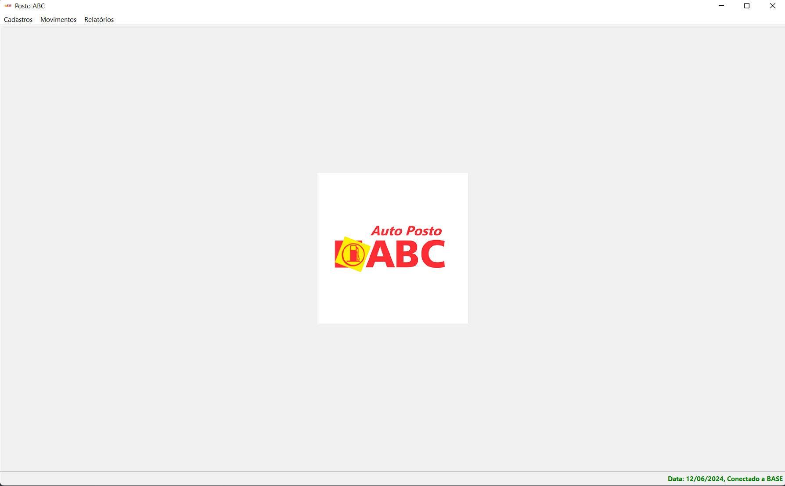
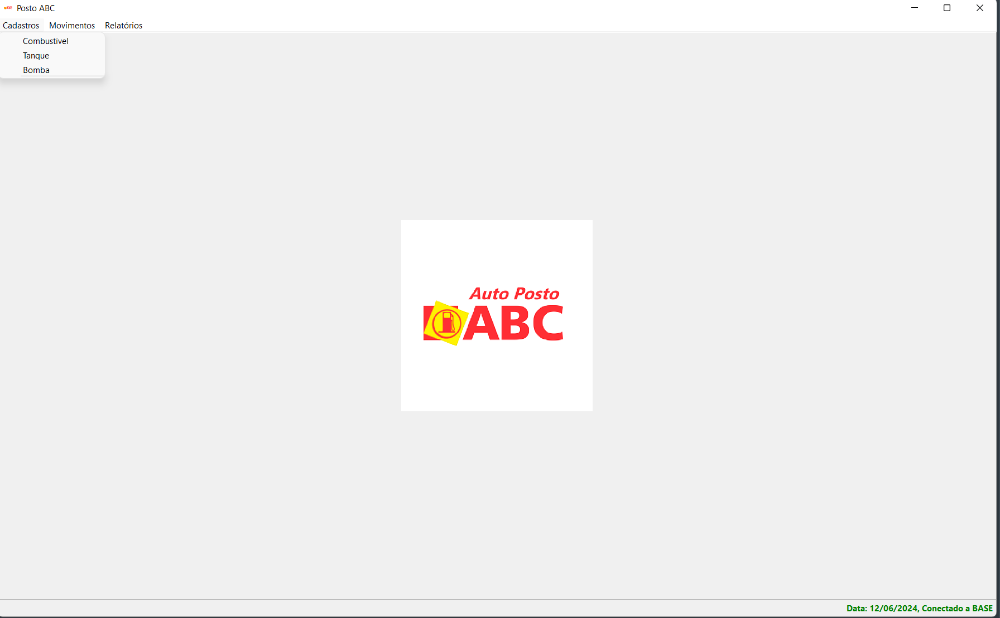
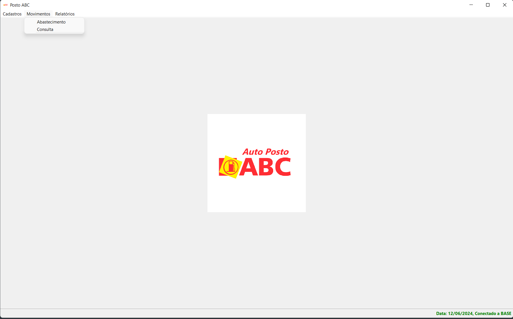
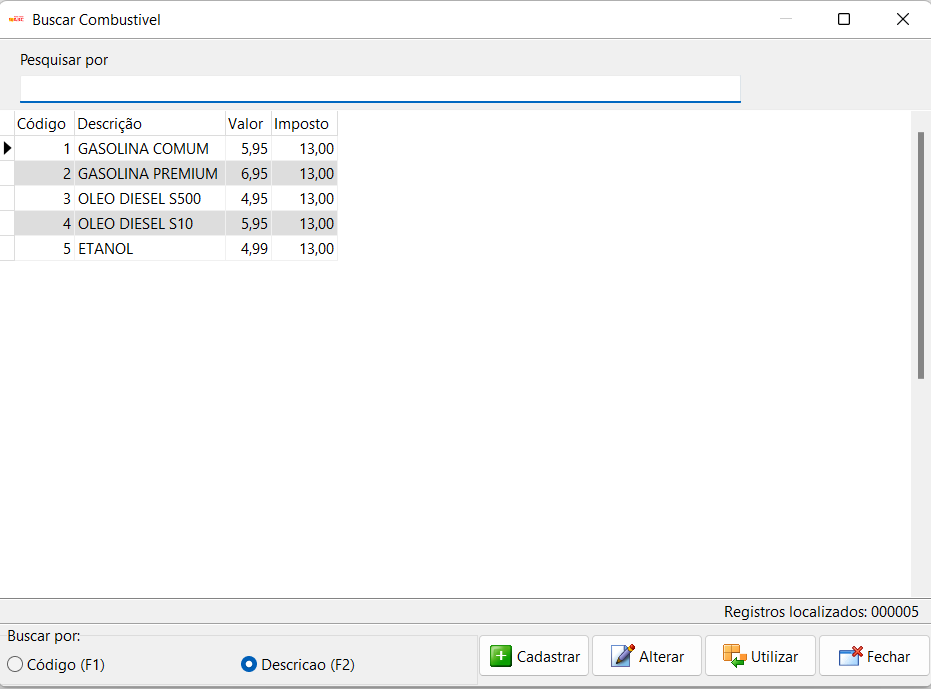
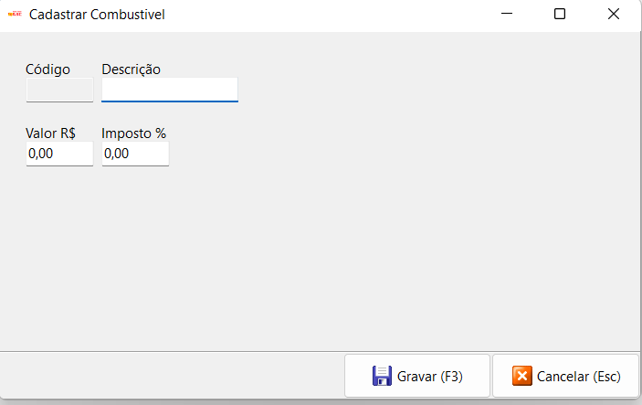
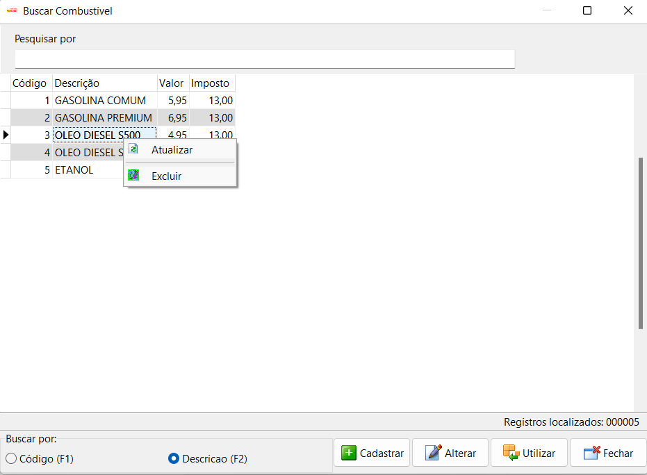
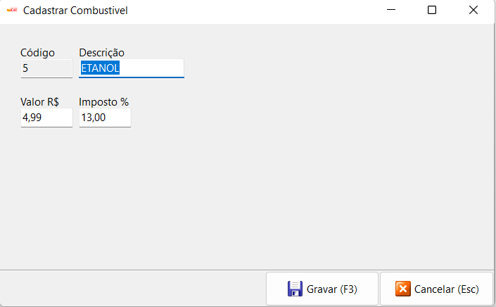
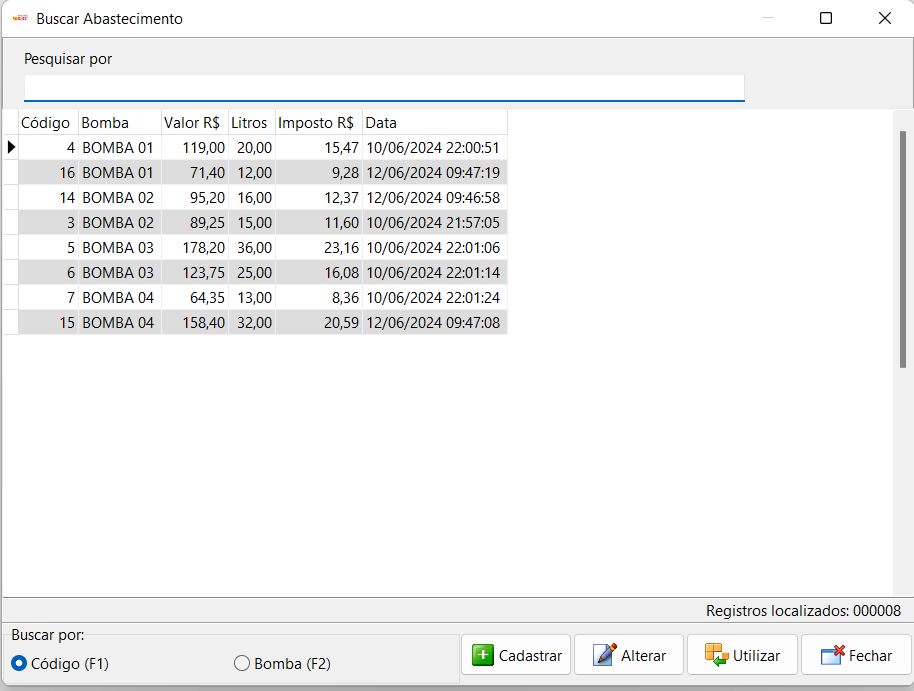
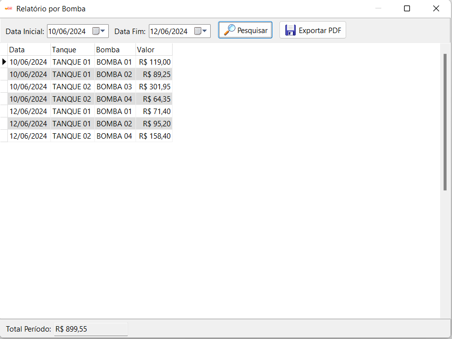
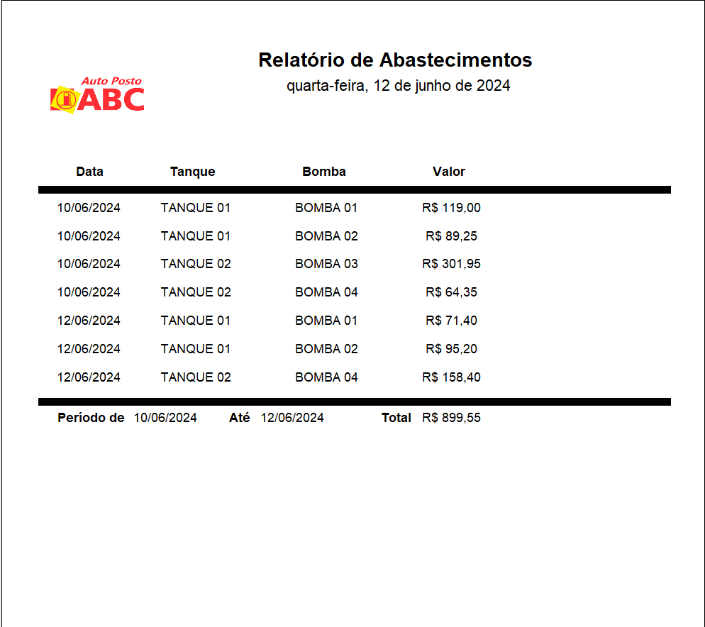

# Aplicação: Controle de Abastecimentos (PostoABC)

Sistema completo para o controle dos abastecimentos realizados no posto abc.

# Requisitos funcionais:

    1 - Controlar os abastecimentos feitos durante cada dia, identificando a bomba utilizada, a quantidade de
        litros e o valor abastecido.
    2 - Em cada abastecimento incide um imposto de 13% do valor abastecido, e essa informação deve ser registrada.
    3 - Cada bomba está ligada a um tanque. No posto ABC existem dois tanques, um de gasolina e um de óleo diesel.
        Para cada tanque duas bombas de combustível.
    4 - Um relatório em que os abastecimentos fossem agrupados, exibindo o dia, o tanque, a bomba e o valor.
        E ao final do relatório a soma total do período.

## Ambiente de Desenvolvimento

Para execucão do projeto local:

1. Ter o Delphi e Firebird instalados em seu ambiente
2. Clone este repositório em sua máquina local.
3. No diretório raiz do projeto, abra a IDE e execute o projeto no play ou no comando:

```
ctrl + shift + F9

4. A aplicação abrirá a tela home.

<b>Informações do Projeto</b>
<br/>
Versão do Delphi usada: Delphi 11.<br/>
Conexão com o banco de dados: Firedac.<br/>
SGBD usado: IBExpert.<br/>
Banco de dados: Firebird.<br/>
Gerador de relatórios: Fortes Report.<br/>
<br/>
<a href="https://www.linkedin.com/in/alefe-alves/" target="_blank">Álefe Alves</a><br/>
alefealves@hotmail.com<br/>

## Funcionalidades

1. **Tela Inicial**: Primeira tela ao iniciar a aplicação



2. **Menu Cadastros**: Menu cadastros de Combustivel, Tanque, Bomba



3. **Menu Movimentos**: Menu movimentos de abastecimentos



4. **Menu Relatorios**: Menu relatórios de abastecimentos


5. **Tela Padrao Busca**: Tela padrao de busca



6. **Tela Padrao Cadastro**: Tela Padrao de Cadastro



7. **Tela Excluir**: Tela com menu excluir



8. **Tela de Alteracao**: Tela de alteracao de cadastro



9. **Tela Buscar Abastecimentos**: Tela de busca de abastecimentos



10. **Tela de Relatório**: Tela de relatório por bomba



11. **Relatório PDF**: Modelo de relatório usando Fortes Reports


```
